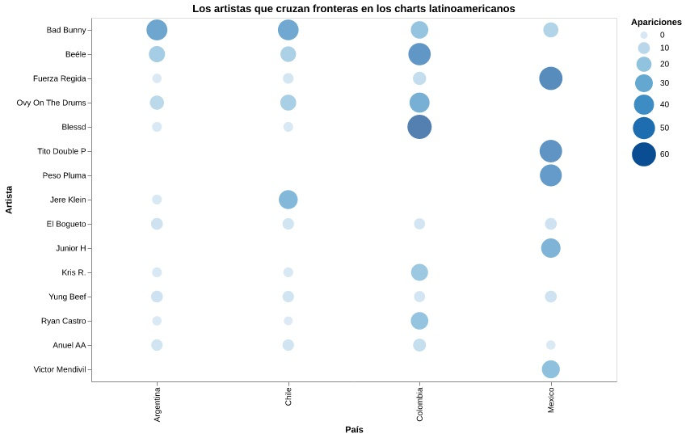

# Los artistas que cruzan fronteras en los charts de Latinoamérica

Los charts de Spotify suelen leerse como rankings nacionales, una lista que muestra qué canciones fueron más escuchadas en un país durante una semana determinada. Sin embargo, cuando esos datos se observan en conjunto y durante varios meses, las listas dejan de funcionar como fotografías aisladas y empiezan a revelar una red de circulación musical. La pregunta ya no es solo qué se escucha en cada país, sino qué artistas logran repetirse entre mercados y convertirse en parte de una banda sonora compartida en Latinoamérica.

Esta visualización muestra la presencia de artistas en los charts de Spotify de Argentina, Chile, Colombia y México durante seis meses. Cada punto representa la aparición de un artista en un país, mientras que el tamaño y la intensidad del círculo indican cuántas veces se repite dentro del período analizado. La matriz permite observar no solo qué artistas aparecen más veces, sino también en qué países se repiten y qué tan extendida es su presencia regional.

Uno de los casos más claros es Bad Bunny, que aparece con presencia en los cuatro países analizados. Su posición en la matriz permite observar un fenómeno regional: no se trata de un artista fuerte solo en un mercado específico, sino de un nombre instalado transversalmente en la escucha latinoamericana. Algo similar ocurre con Beéle y Ovy On The Drums, cuya presencia destaca especialmente en Colombia, pero también aparece conectada con otros países del análisis.

La visualización también permite ver diferencias entre tipos de circulación. Mientras artistas como Bad Bunny tienen una presencia más transversal, otros muestran una concentración territorial más marcada. Fuerza Regida, Peso Pluma, Tito Double P, Junior H y Víctor Mendivil aparecen con especial fuerza en México, lo que evidencia el peso de la música regional mexicana dentro de ese mercado. En cambio, Jere Klein aparece con mayor presencia en Chile, lo que permite observar cómo ciertos artistas pueden tener una circulación más localizada o más vinculada a mercados específicos.

En el caso de Chile, el gráfico permite observar su conexión con artistas de circulación regional, pero también ciertos rasgos propios. Comparado con México, donde se observa una fuerte presencia de artistas vinculados a la música regional mexicana, Chile comparte nombres con otros países, pero también muestra artistas que no necesariamente se repiten con la misma intensidad en todos los mercados. Esto abre una pregunta central para la historia del proyecto: si Chile funciona principalmente como receptor de tendencias regionales, como amplificador de ciertos sonidos o como un mercado con patrones de escucha propios dentro de la región.

La visualización, por tanto, no solo muestra artistas repetidos. También permite leer los charts como señales de conexión cultural. Allí donde un mismo nombre aparece en distintos países, se abre una pista sobre los gustos compartidos, las industrias que logran mayor alcance y las burbujas de escucha que conectan o diferencian a los mercados latinoamericanos.

Mirar estos patrones es relevante porque permite comprender la música como un fenómeno de circulación, no solo de éxito individual. Los artistas que cruzan fronteras en los charts no solo acumulan reproducciones, también revelan qué sonidos, géneros y escenas logran instalarse en más de un territorio. Así, la matriz funciona como una primera entrada para entender cómo se configura el mapa musical regional y qué tan compartida es, realmente, la escucha en Latinoamérica.
